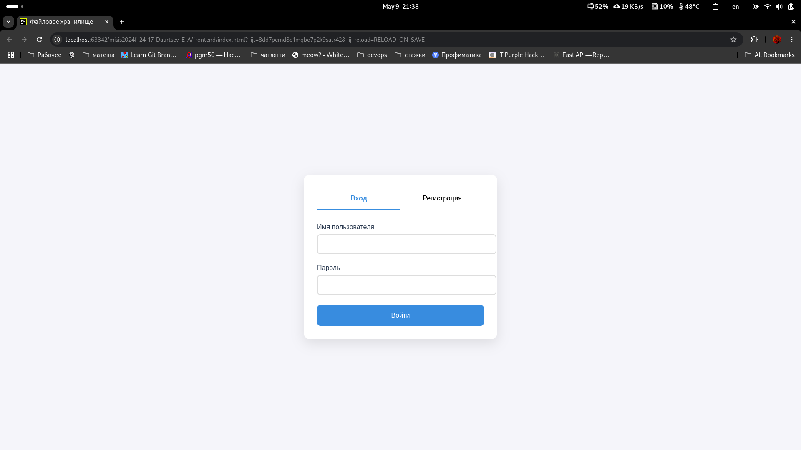
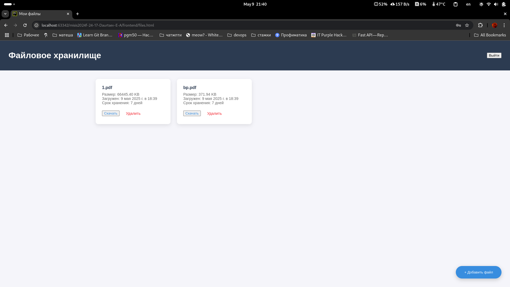
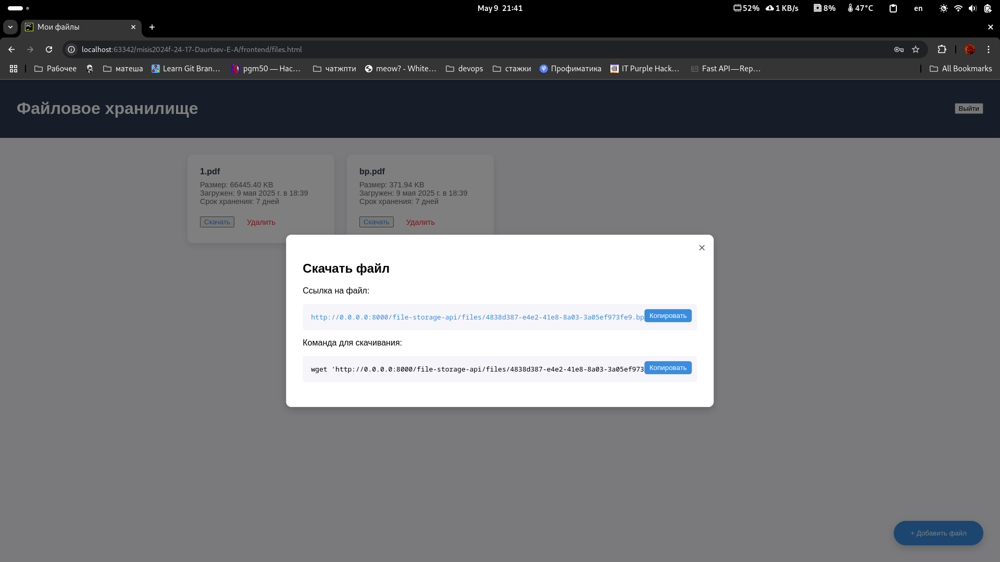

# FILE STORAGE Хранилище

## Как работает
Хранилище для ваших файлов с авторизацией и возможностью делиться файлами с другими людьми. Имеется возможность добавлять, удлаять файлы, устанавливать срок жизни файла до удаления а также получать ссылку на скачивание файла.

## Используемые технологии:
- fastapi
- postgrsql
- alembic 
- docker
- авторизация на jwt токенах (AuthX lib)

## Скриншоты интерфейса





## Реализовано:

- [x] Обязательные требования (10)
- [x] Работа с файлами (`file_storage_api/app/file/api.py`, download_file_by_link(), create_file(), загрузка переменных из .env)
- [x] Интеграция со сторонними апи (`frontend/index.html`, catOverlay, использование апи с коткиами для оповещения об успешной регистрации)
- [x] Реализация системы конфигурации (`file_storage_api/config.py`)
- [x] Графический веб-интерфейс (`frontend`)
- [x] Rest API (`file_storage_api/app/file/api.py`, `file_storage_api/app/user/api.py`)
- [x] Работа с базой данных (`file_storage_api/db` + ручки в `*/api.py`)
- [x] Паттерны проектирования: Синглтон (`file_storage_api/config.py`, `file_storage_api/app/security.py` ), Dependency injection (Depends в `*/api.py`)
- [x] Асинхронность (весь бекенд, и работа с бд)  

--------------------------------------------------------------
- [x] Типизация в питоне
- [x] Докер образ (для запуска postgrsql)
-------------------------------------------------------------


## Инструкция к запуску 
*Для запуска потребуется установить python3.13+, poetry, docker, docker-compose, если отсутсвуют в системе
```
git clone https://github.com/misis-programming2024-2025/misis2024f-24-17-Daurtsev-E-A.git
cd misis2024f-24-17-Daurtsev-E-A
```  

Скопировтаь переменные среды
```commandline
cp example.env .env
```
Создать poetry окружение и установить зависимости
```commandline
poetry env use python3.13
poetry install
```
Запуск:
```
make up
```
Если ругается на psycopg (было на старых версиях fedora), то еще `poetry add psycopg-binary`

Далее открываем проект в pycharm правой кнопкой мыши по `frontend/index.html`->`open in`->`browser`
Принципиально открывать через pycharm потому что только в этом случае работают вхардкоденные cors


